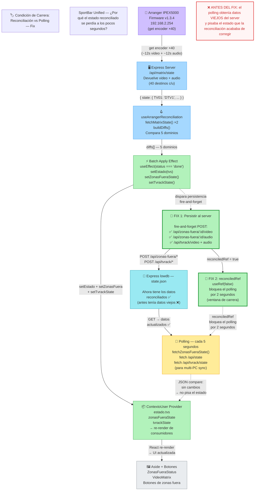

# Condición de Carrera: Reconciliación vs Polling — Fix

---

## Explicación

### ❌ El problema (antes del fix)

1. La reconciliación consulta al Arranger y encuentra diferencias con el estado de la app
2. El **Batch Apply Effect** actualiza `zonasFueraState` y `tvrackState` en memoria React
3. **Pero nunca persiste esos cambios al servidor Express**
4. El **Polling** (cada 5 segundos) consulta `fetchZonasFueraState()` al servidor
5. El servidor todavía tiene los **datos viejos** (nadie le avisó del cambio)
6. El polling aplica los datos viejos → **PISA el estado reconciliado** ❌

**Resultado**: el Aside y los botones mostraban el estado correcto por ~5 segundos, luego volvían al estado viejo.

### ✅ La solución (2 fixes)

**FIX 1 — Persistir al server**: después de actualizar el estado en memoria, el batch apply hace POSTs fire-and-forget a:
- `/api/zonas-fuera/:id/video` y `/api/zonas-fuera/:id/audio` (por cada zona cambiada)
- `/api/tvrack/video` y `/api/tvrack/audio`

**FIX 2 — Flag de protección**: `reconciledRef` (useRef) bloquea los 3 efectos de polling durante 2 segundos. Esto previene la carrera entre el POST (todavía en vuelo) y el siguiente GET del polling.

### Secuencia corregida

1. Batch apply → `setZonasFueraState(nuevo)` ✅
2. Batch apply → POST al server (persiste) 🔧
3. `reconciledRef = true` → polling bloqueado 2s 🔧
4. 2s después → `reconciledRef = false`
5. Polling → GET → datos actualizados ✅ → `JSON.compare` coincide → **no pisa**
